  

---

## About Me

I'm **Afiq Tahir**, a Computer Science student passionate about building modern web applications with a strong focus on clean code, maintainable architecture, and user-friendly interfaces.

- 🌱 Currently learning **TypeScript**, **Clean Architecture**, and **Docker**
- 💻 Building scalable web apps with **Laravel** and **React**
- 🎨 Interested in crafting better user experiences through thoughtful UI/UX
- 🐧 Daily driving **Linux** as my development environment
- 📐 Exploring software architecture and system design

---

## Tech Stack

---

## GitHub Analytics

 

---

## Featured Projects

| Project | Description | Tech | Status |
|---------|-------------|------|--------|
| 🌐 Portfolio Website | Personal portfolio site | React, Tailwind | 🚧 In Progress |
| 📚 Academic Information System | Full-stack academic management platform | Laravel, PostgreSQL | ✅ Complete |
| ⚙ Laravel REST API | RESTful backend service | Laravel, MySQL | 🚀 Live |
| 🎨 UI Components | Reusable React component library | React, TypeScript | 🚧 In Progress |

---

## Contribution Snake

<picture>
  <source media="(prefers-color-scheme: dark)" srcset="https://github.com/afiqtahir/afiqtahir/blob/output/github-contribution-grid-snake-dark.svg" />
  <source media="(prefers-color-scheme: light)" srcset="https://github.com/afiqtahir/afiqtahir/blob/output/github-contribution-grid-snake.svg" />
  
</picture>

---

---

## Connect

&nbsp;

&nbsp;

---

